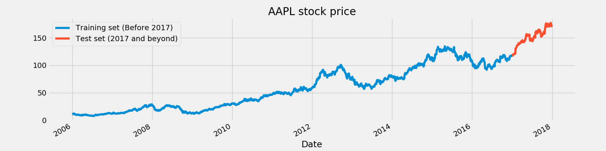
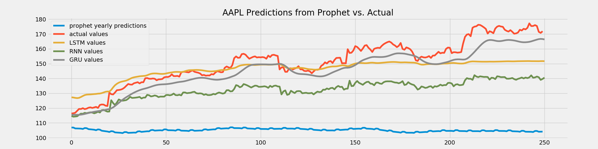

## Time Series Forecasting
The associated [medium post for this repository is available here](https://medium.com/@josh_2774/predicting-stock-prices-using-deep-learning-models-310b41cec90a).

Recent advances in deep learning and computing needed to train deep learning models has led to improved abilities for forecasting.  Prior to these new methods, [ARIMA](https://otexts.com/fpp2/arima.html) models were the main methods for making predictions. New models include:

* **RNNs**
* **LSTMs**
* **GRUs**

Each of these follow a recurrent structure, which differs from other deep learning methods because they allow previous input values to influence later outputs.

## Files

Here we will tie together the following files:

* **time-series.py**
* **data/**
* **figures/**
* **figures/results/**

There are a number of files available in this repository. In order to look into how well each of the different methods for forecasting performs, you can run the `time-series.py` script.  

It will run each of these techniques:

* Simple RNN
* LSTM
* GRU
* Prophet (from Facebook)

For each of the of the `.csv` files found in `data\`, the results will be produced in the `figures\` folder.

Prior to producing the results, you will see a plot of the stock price over time split into training and test set like shown here:



Then once all of the predictions have been made, you can see a visual of well each set of predictions compared to the test dataset in the `figures/results` directory.




## How to use this repository?

In order to retrieve the predictions, first clone this repository to your local and move into it.

```
git clone https://github.com/jbernhard-nw/stock-price-forecasting.git
cd stock-price-forecasting
```

Then simply run the `time-series.py` script.

```
$ python time-series.py
```

This will print notifications for the different models being trained, and then place the results for each stock in the `figures` directory.

The placement in this directory shown with the `AAPL` stock represents how the results will appear when the script has finished.

If you would like to try this with additional stock data.  The data used for this example was pulled from [Kaggle here](https://www.kaggle.com/szrlee/stock-time-series-20050101-to-20171231).

## Given Credit Where Credit is Due
The data and inspiration for this repository came [from Kaggle](https://www.kaggle.com/szrlee/stock-time-series-20050101-to-20171231).  Additionally, this [notebook by Siddharth Yadav here](https://www.kaggle.com/thebrownviking20/intro-to-recurrent-neural-networks-lstm-gru) was a huge part of the work here.  These two are re-linked below, as well as additional resources that were used to create my medium post and the code for this repository.

- [Siddharth Yadav's notebook](https://www.kaggle.com/thebrownviking20/intro-to-recurrent-neural-networks-lstm-gru)
- [Kaggle's competition providing the data and inspiration](https://www.kaggle.com/szrlee/stock-time-series-20050101-to-20171231)
- [Deep Learning with Python](https://tanthiamhuat.files.wordpress.com/2018/03/deeplearningwithpython.pdf)
- [Corresponding Medium Post](https://medium.com/@josh_2774/predicting-stock-prices-using-deep-learning-models-310b41cec90a)
